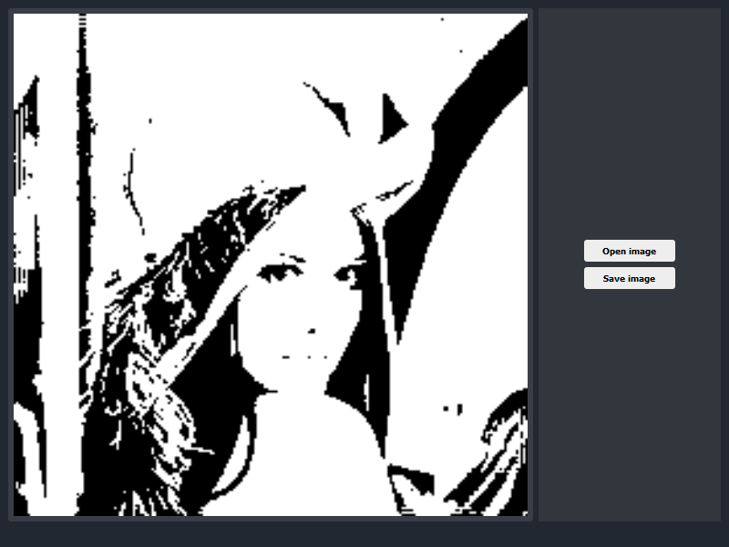

# Mirage Features

#### __Filter__ 

One can use the Convolve function to filter an image with a kernel.

The following example show how to apply a Gaussian Blur to an image using 
a kernel provide in the library.

##### Filter Results 

<p align="center">
	  
</p>

#### __Edges detection__

##### Edges detection Results

Original : 

<p align="center">
	 
</p>

Canny :

<p align="center">
	 
</p>

Sobel :

<p align="center">
	 
</p>

#### __Histogram Equalization__

##### Histogram Equalization Results 

<p align="center">
	 
</p>


<p align="center">
	 
</p>

### __Fourier transform__

DFT and FFT 2D algorithms provide the ability to work directly 
in the frequency domain.

<p align="center">
	 
</p>

### __Viewer__

The viewer provide an easy and fast way to visualize image processing algorithms.
 
```cpp
#include <QApplication>

#include <Mirage/Mirage.hpp>
#include <Mirage/Viewer/Viewer.hpp>

int main(int argc, char** argv)
{
    QApplication app{argc, argv};

    mrg::Viewer viewer = mrg::Viewer([](mrg::Matrix<uint16_t> img) -> mrg::Matrix<uint16_t>
        {
            auto raw = mrg::Canny(img);
            return mrg::Matrix<uint16_t>(raw.DataInType<uint16_t>(), raw.Width(), raw.Height(), 1);
        }
    );
    viewer.show();

    return app.exec();
}
```

### __Image vectorization operation__

#### Threshold example 
```cpp
    mrg::Viewer viewer = mrg::Viewer([](const mrg::Matrix<uint16_t>& img) -> mrg::Matrix<uint16_t>
        {
            auto temp = mrg::Matrix<uint16_t>(img);
            temp[temp < 100] = 0;
            temp[temp >= 100] = 255;
            return temp;
        }
    );
    viewer.show();
```

<p align="center">
	 
</p>
