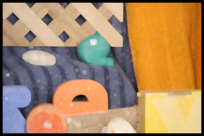
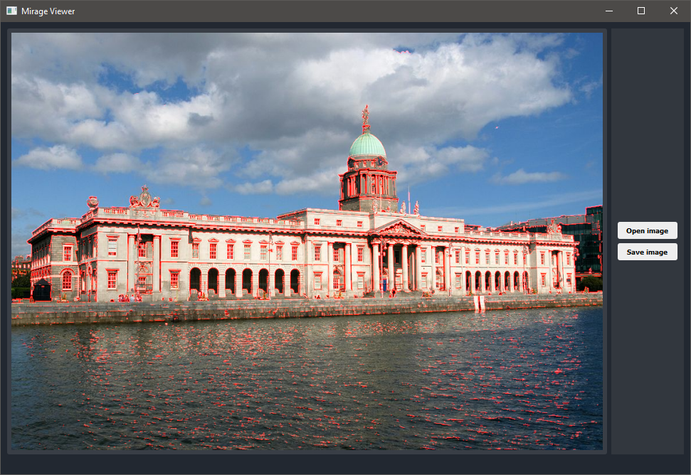

# Mirage Features

#### __Filter__ 

##### Classic filters 

The following example show how to apply a Gaussian Blur to an image using 
a kernel provide in the library.

<p align="center">
	  
</p>

##### Procedural filters 

Another type of convolution is also implemented to ease the work directly with the kernel 
as it can be needed for dilation or erosion.

The following line of code apply a dilation on the `mat` object.

```cpp
mat = Convolve<uint16_t>(mat, &mrg::KernelMax<uint16_t>, 17);
```

<p align="center">
	  
</p>

#### __Edges detection__

##### Edges detection Results

Original / Canny / Sobel 

<p align="center">
	 
	
	  
</p>

#### __Histogram Equalization__

##### Histogram Equalization Results 

<p align="center">
	 
</p>


<p align="center">
	 
</p>

### __Fourier transform__

DFT and FFT 2D algorithms provide the ability to work directly 
in the frequency domain.

<p align="center">
	 
</p>

### __Viewer__

The viewer provide an easy and fast way to visualize image processing algorithms.
  
```cpp
int main(int argc, char** argv)
{
    QApplication app{argc, argv};

    mrg::Viewer viewer = mrg::Viewer([](const mrg::Matrix<uint16_t>& img) -> mrg::Matrix<uint16_t>
        {
            auto temp = mrg::Matrix<uint16_t>(img);
            if(temp.Channel() > 1)
                temp = mrg::ToGrayScale<uint16_t, uint16_t>(temp);

            return FloydSteinberg(temp);
        }
    );
    viewer.show();

    return app.exec();
}
```

For more details take a look at `examples/viewer/main.cpp`

### __Image vectorization operation__

#### Sobel threshold example 

```cpp
    mrg::Viewer viewer = mrg::Viewer([](const mrg::Matrix<uint16_t>& img) -> mrg::Matrix<uint16_t>
        {
            mrg::Matrix<double> result = Sobel(img);
            result[result < 128.] = 0;
            return mrg::Transform<double, uint16_t>(result, [](const double p){
                return static_cast<uint16_t>(p);
            });
        }
    );
    viewer.show();
```

<p align="center">
	 
</p>
