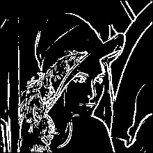
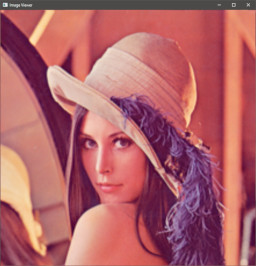

<h1 align="center">Mirage</h1> 

An image processing library for learning purpose in C++17.

Build status (GCC/Linux) : [](https://travis-ci.org/PlathC/Mirage)

## The library 

### __Tasks__

__Library features__

| Feature           | Progress |
|-------------------|----------|
| Image structure   | Done |
| Parser            | Done (PNG) |
| Viewer            | In Progress (Vec4ui image only and distortion of the image.) |

__Image processing features__ 

| Feature                          | Progress |
|----------------------------------|----------|
| Image structure                  | Done |
| Bit depth                        | To do |
| DFT                              | To do |
| Filter                           | Done |
| Sobel / Threshold                | Done |
| Histogram Equalization           | Done |
| Adaptive Histogram Equalization  | To do |
| Canny                            | To do |

###  __Examples__

#### __Filter__ 

One can use the Convolve function to filter an image with a kernel.

The following example show how to apply a Gaussian Blur to an image using 
a kernel provide in the library.

```cpp
#include "Mirage/Mirage.hpp"

int main()
{
    using namespace mrg;

    Matrix<Vec4d> mat = ImageParser::FromFile<Vec4d>("../samples/rubberwhale.png", 4);
    Matrix<Vec4d> matConvolve = mat.Convolve(mrg::gaussianBlurKernel5x5);
    ImageParser::ToFile(matConvolve, "../examples/filter/Results/rubberwhale-convolve.png");

    return EXIT_SUCCESS;
}
```

__Results :__

  

#### __Sobel__

The Sobel function allow the user to apply the Sobel operator to an image.

One can use the Threshold function to highlight output edges.

```cpp
#include "Mirage/Mirage.hpp"

int main()
{
    using namespace mrg;

    Matrix<Vec4d> mat = ImageParser::FromFile<Vec4d>("../samples/lena.png", 4);

    Matrix<double> matConvoluted = mat.Sobel().Threshold<double>();

    ImageParser::ToFile(matConvoluted, "../examples/sobel/Results/lena.png");

    return EXIT_SUCCESS;
}
```

__Results :__ 

  

### Histogram Equalization

The library provide an histogram equalization function for grayscale and 
color image.

```cpp
#include "Mirage/Mirage.hpp"

int main()
{
    using namespace mrg;

    Matrix<Vec4d> mat = ImageParser::FromFile<Vec4d>("../samples/lena.png", 4);
    Timer timer{};

    timer.Start();
    Matrix<double> matGrayScale = mat.ToGrayScale<double>();
    Matrix<double> matEq = matGrayScale.HistogramEqualization();
    timer.Stop();

    std::cout << "Duration : " << timer.Duration() << std::endl;

    ImageParser::ToFile(matEq, "../examples/histeq/Results/lena-eq.png");

    return EXIT_SUCCESS;
}
```


__Results :__ 

  

  

  

### __Viewer__

The viewer can be used as follow :

```cpp
#include <Mirage/Mirage.hpp>
#include <Mirage/Viewer/Viewer.hpp>

int main()
{
    using namespace mrg;
    Matrix<Vec4ui8> mat = ImageParser::FromFile<Vec4ui8>("../samples/tiled4x3.png", 4);
    Viewer viewer = Viewer(800,800, mat);
    try{
        viewer.Show();
    }catch(std::exception& e)
    {
        std::cerr << e.what() << std::endl;
        return EXIT_FAILURE;
    }

    return EXIT_SUCCESS;
}
```

__Results :__



## Build

### Dependencies 
    
- LibPng (Read Png Images)
- Vulkan (Image viewer)
- GLM
- GLFW3
 
### CMake

This project needs CMake to be built. 

### Compiler

This project has been tested with MinGW and MSVC (VS2017).