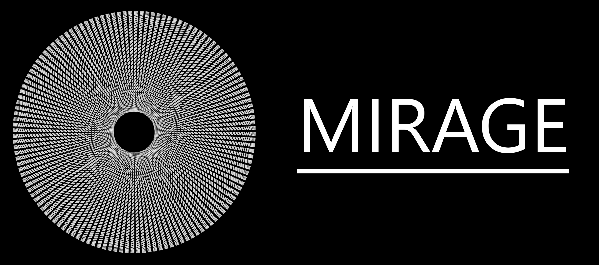

 

An image processing library for learning purpose in C++17.

[__Features description__](Features.md)

 

<h2 align="center">The library</h2>

### __Tasks__

__Library features__

| Feature           | Progress                                                     |
|-------------------|--------------------------------------------------------------|
| Image structure   | Done                                                         |
| Parser            | Done (PNG/JPEG)                                              |
| Mirage Viewer     | In progress                                                  |

__Image processing features__ 

| Feature                                    | Progress             |
|--------------------------------------------|----------------------|
| Image structure                            | Done                 |
| Filter (convolution)                       | Done                 |
| Sobel / Threshold                          | Done                 |
| Histogram Equalization                     | Done                 |
| Canny                                      | Done                 |
| Crop / Scale                               | Done                 |
| Matrix transform                           | In progress          |
| DFT                                        | Done                 |
| FFT                                        | Done                 |
| Mask operations                            | To do                |
| Bit depth / Pixel type                     | To do                |
| Adaptive Histogram Equalization            | To do                |
| Floyd-Steinberg                            | To do                |
| Video support                              | To do                |
| Optimization (Realtime use, GPU - MT)      | To do                |

<h2 align="center">Build</h2>

### Dependencies 

| Feature                          | Dependencies |
|----------------------------------|--------------|
| Mirage + example                 | None         | 
| MIRAGE_BUILD_VIEWER              | QT5          | 
 
### Compiler

This project has been tested with MSVC (VS2019).

